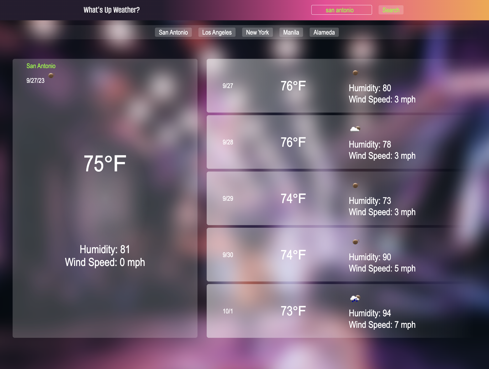

# Whats Up Weather?

## Description

I was motivated to use the skills I'd learned recently by putting local storage further into practice as well as accessing server-side APIs for the first time.
I was also motivated to make this app so people like me could prepare for the best/worst weather ahead of time.
By checking what the temperature is now, I can decide whether I'm gonna wear a poofy jacket that's twice my body width or a tanktop that hugs me in unflattering ways.
I can also make crucial style decisions far in advance by checking what the whether will be for the next five days.
This app would solve the problem of being ill-prepared for the weather -- whether it be style decisions, preparing to go out, or deciding to stay in -- this app has your weather needs covered.

In creating this app, I learned a bit more about how the return statement works.
I learned that I prefer to build my own CSS as quickly as I can rather than sift through bootstrap documentation.
More importantly, I learned how to access third-party APIs.
Although I didn't just learn this -- I got to actually use more array and string methods to manipulate user input and how I want them to display on my page.

I continue to learn how placement really matters. Even when I think one way makes sense, I am still astounded how moving tiny parts in totally different places provides such drastic changes.

## Installation

N/A

## Usage

When the user visits the What's Up Weather app for the first time, they will be met by a clean interface that only desires one interaction: user input.

When the user enters and searches a city name, they will be able to view the city's current temperature, humidity level, and wind speed, along with a nifty little icon that resembles current weather conditions. The next five-day forecast also displays the same information.

Upon conducting the search, the user will be presented with a newly generated history button that accesses their most recent search. So should they come back and want easy access to a prior search of theirs, one simple click will do the trick and reveal to them the current weather conditions and next five-day forecast of the corresponding city.

The ticker of history buttons provides a clean interface where no more than five buttons will show at a time. Additionally, the most recent search will always start at the beginning of the list of history buttons.

However, if a user enters a typo or is just plain bad at following instructions (the input box's placeholder instructs them to enter a city name) and enters any word but a city -- an alert box will prompt the user to enter a valid city name. If the user does not, no new weather information will be displayed.

Once the user is done conducting their business and leaves the page, when they return, their last five searches will be here waiting for them to access with one simple click.

## Credits

W3Schools, change placeholder color.  
https://www.w3schools.com/howto/howto_css_placeholder.asp
CSS 57-66

Meg M. (TA)/ edX.  
API endpoints

## Deployed Link
Please enjoy the [What's Up Weather](url) app!